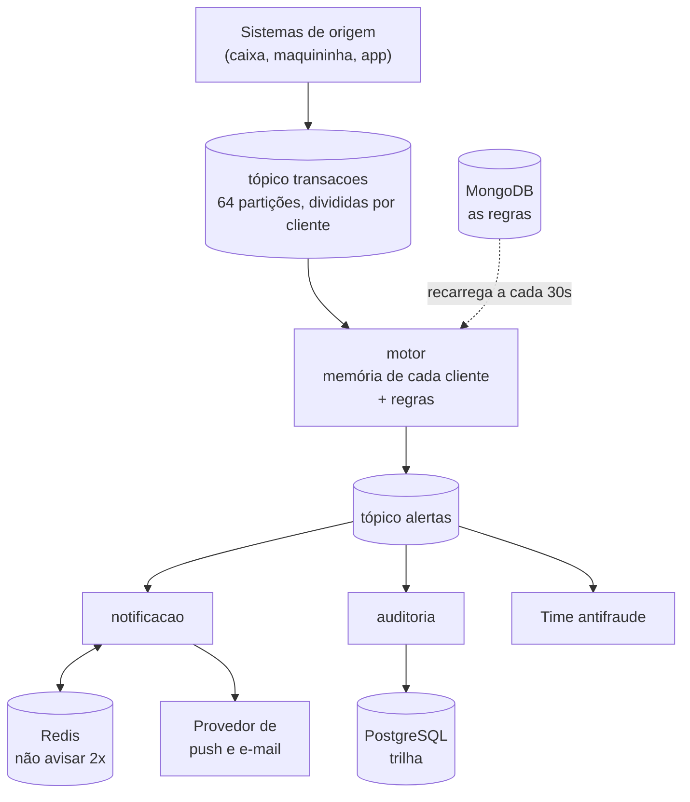
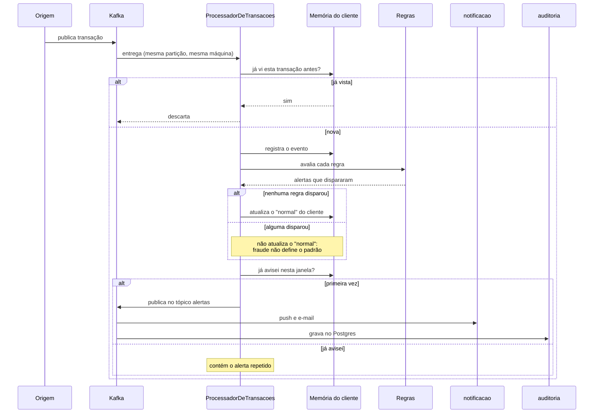
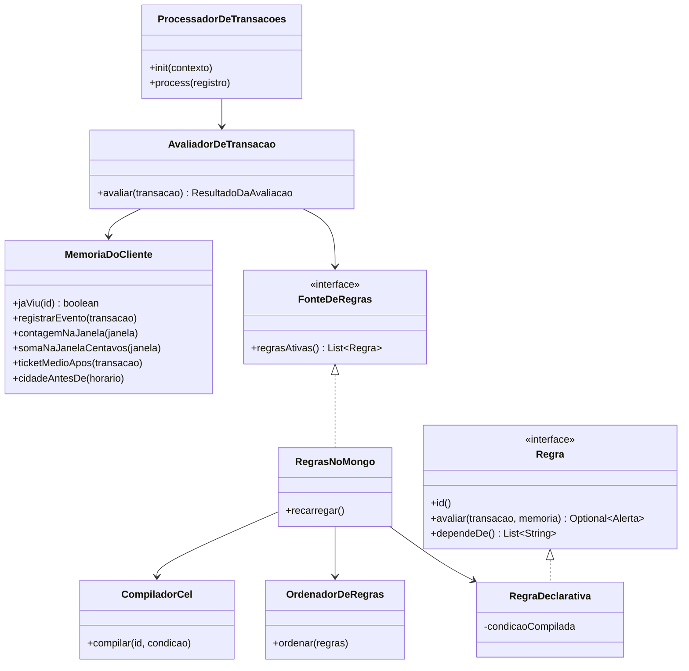

# motor-antifraude

Motor de detecção de transações suspeitas em tempo real.

Case técnico do processo seletivo de Engenharia de Software Backend do Itaú.

O raciocínio por trás de cada decisão está em **[docs/solucao.md](docs/solucao.md)**.

---

## A arquitetura



**A ideia central:** o tópico de entrada é dividido em 64 partições, e a partição de cada transação é decidida pela
identificação do cliente. Assim **todas as transações de uma pessoa caem sempre na mesma máquina**, que tem a memória
completa dela ali do lado — sem consultar ninguém.

Também foi escolhido modularizar a aplicação, mas em um ambiente real seria extremamente viavel a adoção de um arquitetura de microsserviços.

---

## O fluxo de uma transação



---

## As classes principais do motor



---

## Como rodar

**Precisa de:** JDK 21 e Docker.

```bash
docker compose up -d
```

Sobe Kafka, MongoDB, PostgreSQL, Redis, Prometheus e Grafana, e cria os tópicos.

```bash
./mvnw clean install
```

```bash
./infra/carregar-regras.sh
```

Publica as regras de `regras/regras.yml` no MongoDB.

Depois suba cada aplicação, pela IDE ou por linha de comando:

```bash
java -jar motor/target/motor-0.1.0-SNAPSHOT.jar
```

```bash
java -jar simulador/target/simulador-0.1.0-SNAPSHOT.jar
```

```bash
java -jar notificacao/target/notificacao-0.1.0-SNAPSHOT.jar
```

```bash
java -jar auditoria/target/auditoria-0.1.0-SNAPSHOT.jar
```

O motor leva cerca de 40 segundos para assumir as 64 partições.

| Serviço     | Porta |
|-------------|-------|
| motor       | 8081  |
| notificacao | 8082  |
| auditoria   | 8083  |
| simulador   | 8084  |
| Grafana     | 3000  |
| Prometheus  | 9090  |
| Kafka UI    | 8090  |

---

## Como testar

### Os endpoints do simulador

O simulador cria **200 mil clientes fictícios**, cada um com um padrão próprio de gasto e cidade. Em todos os endpoints
o parâmetro `cliente` é opcional — sem ele, o simulador sorteia um.

#### `GET /simulador/status`

Mostra se a carga contínua está ligada, a taxa atual e quantos clientes existem.

```bash
curl "http://localhost:8084/simulador/status"
```

#### `POST /simulador/historico`

Gera transações **normais** para um cliente, dentro do padrão de gasto dele.

Serve para dar histórico antes de testar fraude. **Sem isso a regra de velocidade não dispara**, porque ela exige pelo
menos 5 transações anteriores — e um cliente novo teria a própria fraude como padrão.

```bash
curl -X POST "http://localhost:8084/simulador/historico?cliente=cli-000500&quantidade=10"
```

| Parâmetro    | Padrão  | O que faz          |
|--------------|---------|--------------------|
| `cliente`    | sorteia | qual cliente       |
| `quantidade` | 10      | quantas transações |

#### `POST /simulador/fraude`

Gera uma sequência **suspeita**: valores de 6 a 12 vezes o normal do cliente, todos numa cidade diferente da habitual,
por compra online.

Aciona as regras `velocidade-alta`, `soma-na-hora`, `cidade-diferente-no-ecommerce` e a combinada.

```bash
curl -X POST "http://localhost:8084/simulador/fraude?cliente=cli-000500&quantidade=5"
```

| Parâmetro    | Padrão  | O que faz                       |
|--------------|---------|---------------------------------|
| `cliente`    | sorteia | qual cliente                    |
| `quantidade` | 5       | quantas transações na sequência |

> **Use um cliente diferente a cada rodada.** Repetir o ataque no mesmo cliente muda o resultado,
> porque parte do histórico dele já foi construída pelo teste anterior.

#### `POST /simulador/transacao`

Gera **uma** transação com o valor exato que você mandar. É o jeito de testar a regra de valor alto.

```bash
curl -X POST "http://localhost:8084/simulador/transacao?cliente=cli-000500&valor=6000"
```

| Parâmetro | Padrão      | O que faz      |
|-----------|-------------|----------------|
| `cliente` | sorteia     | qual cliente   |
| `valor`   | obrigatório | valor em reais |

#### `POST /simulador/carga/ligar`

Liga um fluxo contínuo de transações normais, distribuídas entre todos os clientes. Serve para ver o sistema sob volume.

```bash
curl -X POST "http://localhost:8084/simulador/carga/ligar?taxa=500"
```

| Parâmetro | Padrão                     | O que faz              |
|-----------|----------------------------|------------------------|
| `taxa`    | do arquivo de configuração | transações por segundo |

#### `POST /simulador/carga/desligar`

Desliga o fluxo contínuo.

```bash
curl -X POST "http://localhost:8084/simulador/carga/desligar"
```

#### `POST /simulador/verificar-particao`

Publica a mesma transação várias vezes e mostra em qual partição do tópico cada uma caiu. Serve para confirmar que **o
mesmo cliente cai sempre no mesmo lugar** — que é o que faz o sistema funcionar.

```bash
curl -X POST "http://localhost:8084/simulador/verificar-particao?cliente=cli-000042&repeticoes=6"
```

| Parâmetro    | Padrão  | O que faz           |
|--------------|---------|---------------------|
| `cliente`    | sorteia | qual cliente        |
| `repeticoes` | 5       | quantas publicações |

### Um teste completo, do começo ao fim

```bash
curl -X POST "http://localhost:8084/simulador/historico?cliente=cli-000500&quantidade=10"
```

Espere alguns segundos e dispare a fraude:

```bash
curl -X POST "http://localhost:8084/simulador/fraude?cliente=cli-000500&quantidade=5"
```

Teste a regra de valor alto, que independe de histórico:

```bash
curl -X POST "http://localhost:8084/simulador/transacao?cliente=cli-000500&valor=6000"
```

### Endpoints do motor

Listar as regras que estão valendo agora:

```bash
curl "http://localhost:8081/regras"
```

Desligar uma regra na hora, sem esperar os 30 segundos da recarga:

```bash
curl -X POST "http://localhost:8081/regras/velocidade-alta/desligar"
```

```bash
curl -X POST "http://localhost:8081/regras/velocidade-alta/ligar"
```

Desligar uma regra **desliga junto** as regras combinadas que dependem dela.

### Endpoints do serviço de notificação

Derrubar o provedor de push e e-mail, para ver o sistema degradar sem parar:

```bash
curl -X POST "http://localhost:8082/provedor/derrubar"
```

```bash
curl -X POST "http://localhost:8082/provedor/levantar"
```

Com o provedor derrubado, a detecção continua, os alertas continuam sendo gravados na auditoria, e o que não foi
entregue vai para a fila morta.

### Mudar uma regra sem reiniciar nada

Edite `regras/regras.yml` e publique:

```bash
./infra/carregar-regras.sh
```

Em até 30 segundos a regra nova está valendo, com o sistema no ar.

---

## Onde ver o resultado

**Grafana** — http://localhost:3000

| Painel                | Responde                                                   |
|-----------------------|------------------------------------------------------------|
| Plantão SRE           | "está de pé?" — volume, tempo de resposta, fila, disjuntor |
| Qualidade da detecção | "está acertando?" — disparos por regra, taxa de alerta     |

**Kafka UI** — http://localhost:8090 — o conteúdo de cada tópico e o atraso do motor.

**No log do motor:**

```bash
grep ALERTA /tmp/motor.log
```

---
